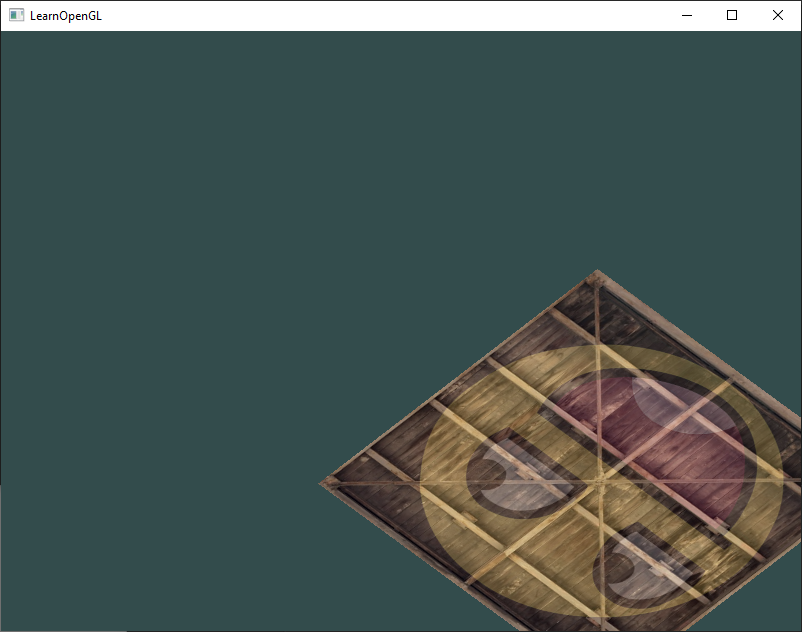
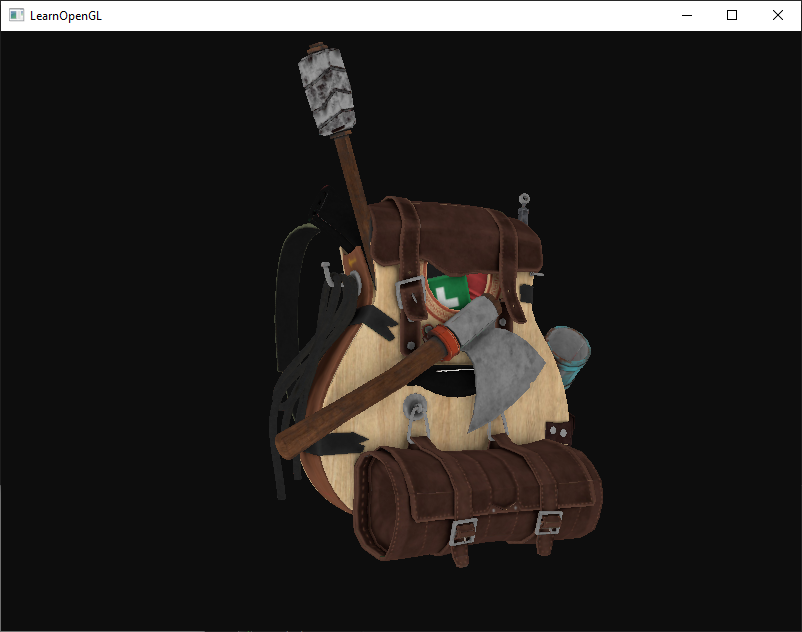
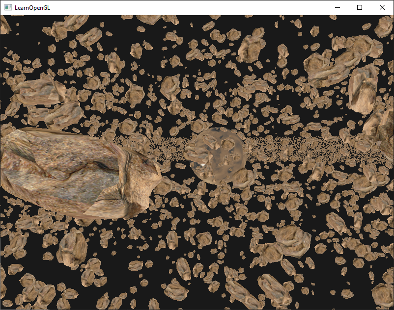
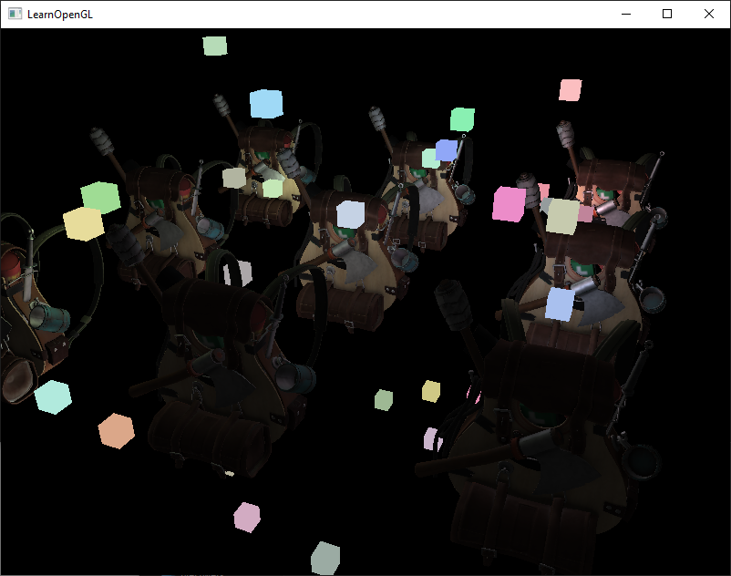
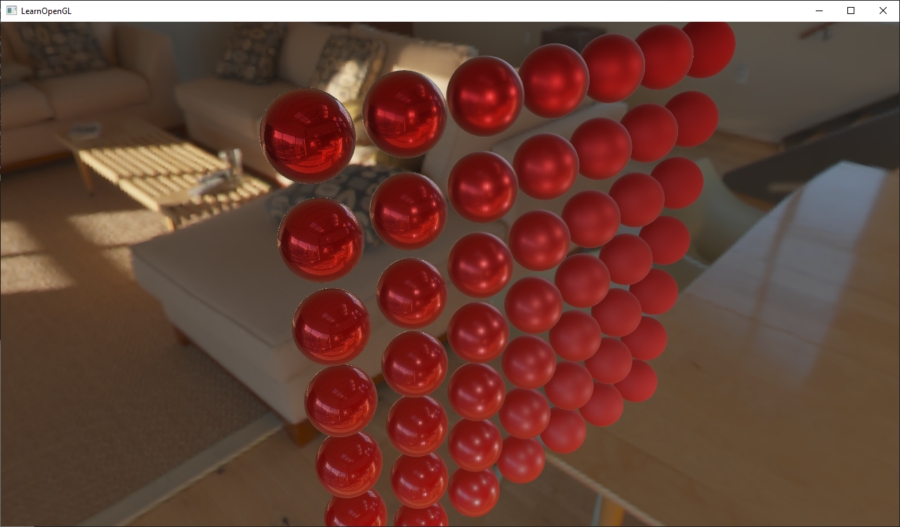

# learnopengl.com code repository (Python version)
Python translation of the popular [LearnOpenGL](https://learnopengl.com)'s source code and exercise repository.
Currently chapters 1-6 have been completely translated.

The translation is very close to the original C++ source code, which makes it easy to use alongside the tutorial.

Most examples should run right out of the box, as they install the PyPI requirements automatically from the respective `requirements.txt`.

You can find the examples in the `src` folder.  
To run the first example you simply need to run `src/1.getting_started/1.1.hello_window/hello_window.py`.

Here are some screenshots of the examples (one from each chapter):  
## Chapter 1, [Exercise 5.1](https://github.com/Zuzu-Typ/LearnOpenGL-Python/tree/master/src/1.getting_started/5.1.transformations)

## Chapter 2, [Exercise 6](https://github.com/Zuzu-Typ/LearnOpenGL-Python/tree/master/src/2.lighting/6.multiple_lights)

## Chapter 3, [Exercise 1](https://github.com/Zuzu-Typ/LearnOpenGL-Python/tree/master/src/3.model_loading/1.model_loading)

## Chapter 4, [Exercise 10.3](https://github.com/Zuzu-Typ/LearnOpenGL-Python/tree/master/src/4.advanced_opengl/10.3.asteroids_instanced)

## Chapter 5, [Exercise 8.1](https://github.com/Zuzu-Typ/LearnOpenGL-Python/tree/master/src/5.advanced_lighting/8.1.deferred_shading)

## Chapter 6, [Exercise 2.2.1](https://github.com/Zuzu-Typ/LearnOpenGL-Python/tree/master/src/6.pbr/2.2.1.ibl_specular)

(Work in progress)
